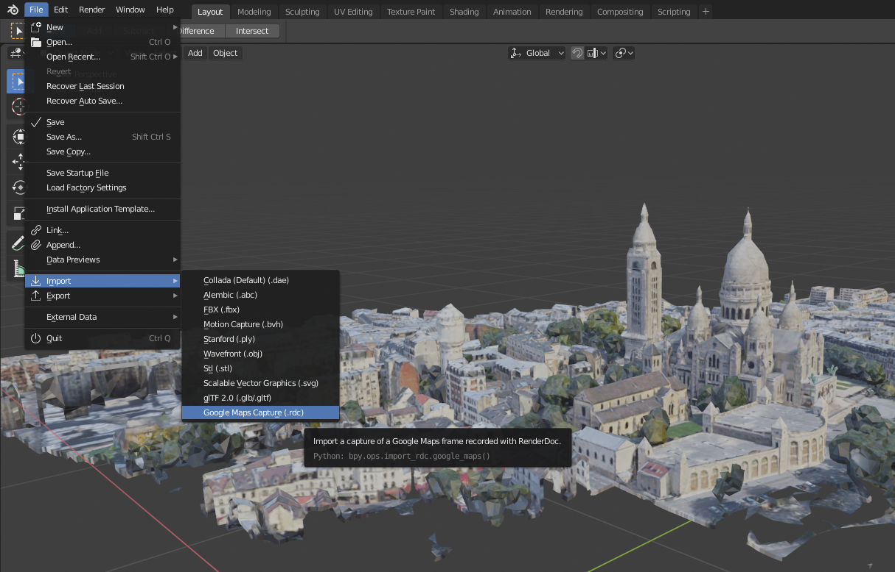

Maps Models Importer
====================

*Maps Models Importer* is a set of tools for importint 3D models from wide maps in 3D content softwares.
This is a proof of concept containing only a Blender add-on for importing 3D models from Google Maps.

The `blender` directory contains the source code of the Blender add-on importing captures recorded with [RenderDoc](https://renderdoc.org/):

**NB** This is an add-on for Blender 2.80 and above, which you can download from [here](https://builder.blender.org/download/).

Installation
------------

Download a [release](TODO) and make a zip of `blender/MapsModelsImporter/`. In Blender, go to `Edit > Preferences`, `Add-on`, `Install`, then browse to the zip file.

Usage
-----

  1. Start RenderDoc, and `File > Inject into process`;

  2. Start chrome using specific flags: `chrome.exe --disable-gpu-sandbox --gpu-startup-dialog --use-angle=gl`. Do NOT press Ok on the dialog box yet;

  3. In RenderDoc, search for the chrome process and inject into it;

  4. Press OK in the chrom dialog;

  5. Go to Google Maps in satellite view, and take a capture using `Print Screen` **while moving** in the viewport;

  6. In RenderDoc, save the capture as an rdc file

  7. In Blender, go to `File > Import > Google Maps Capture` an choose your capture file.

Disclaimer
----------

This is a proof of concept showcasing how the 3D render process of Google Maps can be inspected. This is intended for educational purpose only. For a more in-depth analysis, see [Importing Actual 3D Models From Google Maps](TODO).

Do not use this for any commercial nor redistribution purpose. Actually, the use of such tool might be allowed for private read-only use, as this is what happens when browsing Google Maps, but not beyond. I do not take responsibility for any use of this tool.

Help Wanted
-----------

This repository does not provide the required RenderDoc binaries for linux nor for OSX. If you have such a system, build RenderDoc against Python 3.7.0 (the minor version matters) to be compatible with the version of Blender's Python distribution.

